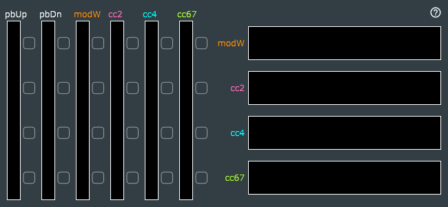

# MIDI Mod-Mate

This is a MIDI effect (can be inserted in the MIDI effects slot of Apple Logic Pro X) to provide a very basic MIDI "macro" capability.

I developed this specifically for use with [Airwave V3 for Omnisphere](https://www.pluginguru.com/products/airwave-v3/), a pair of sound libraries for [Spectrasonics Omnisphere](https://www.spectrasonics.net/products/omnisphere/) developed by Belgian DJ and sound designer Laurent V&eacute;ronnez (aka *Airwave*) and John "Skippy" Lemkuhl aka [PlugInGuru.com](https://www.pluginguru.com/), which are unique in that four distinct MIDI CCs (continuous controllers) can be used to affect the sound in real-time:
 * CC#1 (mod wheel)
 * CC#2 (breath controller)
 * CC#4 (foot controller)
 * CC#67 (soft pedal)

This plug-in allows users who may not have advanced hardware MIDI controllers to get started with the new *Airwave* libraries using only the standard controls available on nearly all MIDI keyboards: pitch bend and mod wheel.

See http://getdunne.net/download/modmate/ for additional details, usage instructions, and links to download pre-built plug-ins in Audio Unit and VST versions. (VST is a trademark and software of Steinberg Media Technologies.)

This software was developed with [JUCE 5.x](https://shop.juce.com/get-juce), hence subject to the [GNU GPL v3 license](https://www.gnu.org/licenses/gpl-3.0.en.html). You'll need to obtain your own copy of JUCE to build this source code. Use the *Projucer* to generate the necessary projects, e.g. VST2 for Windows, Audio Unit for Mac. To build VST/VST3 you'll need the [VST3 SDK](https://github.com/steinbergmedia/vst3sdk) from Steinberg. To distribute any VST plug-in, you'll need a [license from Steinberg Media Technologies GmbH](https://www.steinberg.net/en/company/developers.html).
